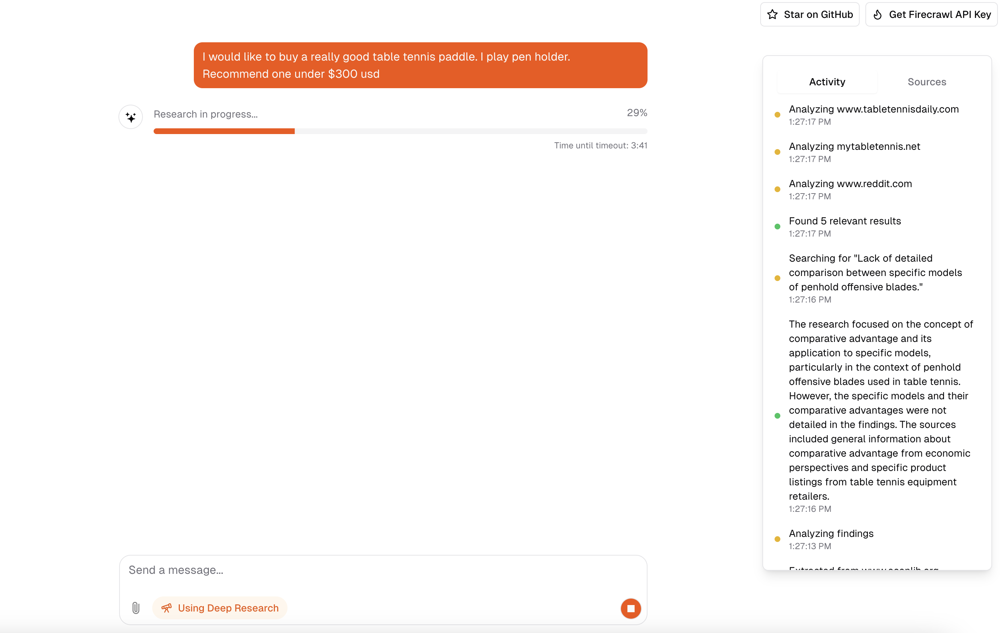

# Open Deep Research

An Open-Source clone of Open AI's Deep Research experiment. Instead of using a fine-tuned version of o3, this method uses [Firecrawl's extract + search](https://firecrawl.dev/) with a reasoning model to deep research the web.

Check out the demo [here](https://x.com/nickscamara_/status/1886459999905521912)



## Features

- [Firecrawl](https://firecrawl.dev) Search + Extract
  - Feed realtime data to the AI via search
  - Extract structured data from multiple websites via extract
- [Next.js](https://nextjs.org) App Router
  - Advanced routing for seamless navigation and performance
  - React Server Components (RSCs) and Server Actions for server-side rendering and increased performance
- [AI SDK](https://sdk.vercel.ai/docs)
  - Unified API for generating text, structured objects, and tool calls with LLMs
  - Hooks for building dynamic chat and generative user interfaces
  - Supports OpenAI (default), Anthropic, Cohere, and other model providers
- [shadcn/ui](https://ui.shadcn.com)
  - Styling with [Tailwind CSS](https://tailwindcss.com)
  - Component primitives from [Radix UI](https://radix-ui.com) for accessibility and flexibility
- Data Persistence
  - [Vercel Postgres powered by Neon](https://vercel.com/storage/postgres) for saving chat history and user data
  - [Vercel Blob](https://vercel.com/storage/blob) for efficient file storage
- [NextAuth.js](https://github.com/nextauthjs/next-auth)
  - Simple and secure authentication

## Model Providers

This template ships with OpenAI `gpt-4o` as the default. However, with the [AI SDK](https://sdk.vercel.ai/docs), you can switch LLM providers to [OpenAI](https://openai.com), [Anthropic](https://anthropic.com), [Cohere](https://cohere.com/), and [many more](https://sdk.vercel.ai/providers/ai-sdk-providers) with just a few lines of code.

This repo is compatible with [OpenRouter](https://openrouter.ai/) and [OpenAI](https://openai.com/). To use OpenRouter, you need to set the `OPENROUTER_API_KEY` environment variable.

## Deploy Your Own

You can deploy your own version of the Next.js AI Chatbot to Vercel with one click:

[](https://vercel.com/new/clone?repository-url=https%3A%2F%2Fgithub.com%2Fnickscamara%2Fopen-deep-research&env=AUTH_SECRET,OPENAI_API_KEY,OPENROUTER_API_KEY,FIRECRAWL_API_KEY&envDescription=Learn%20more%20about%20how%20to%20get%20the%20API%20Keys%20for%20the%20application&envLink=https%3A%2F%2Fgithub.com%2Fvercel%2Fai-chatbot%2Fblob%2Fmain%2F.env.example&demo-title=AI%20Chatbot&demo-description=An%20Open-Source%20AI%20Chatbot%20Template%20Built%20With%20Next.js%20and%20the%20AI%20SDK%20by%20Vercel.&demo-url=https%3A%2F%2Fchat.vercel.ai&stores=[{%22type%22:%22postgres%22},{%22type%22:%22blob%22}])

## Running locally

You will need to use the environment variables [defined in `.env.example`](.env.example) to run Next.js AI Chatbot. It's recommended you use [Vercel Environment Variables](https://vercel.com/docs/projects/environment-variables) for this, but a `.env` file is all that is necessary.

> Note: You should not commit your `.env` file or it will expose secrets that will allow others to control access to your various OpenAI and authentication provider accounts.

1. Install Vercel CLI: `npm i -g vercel`
2. Link local instance with Vercel and GitHub accounts (creates `.vercel` directory): `vercel link`
3. Download your environment variables: `vercel env pull`

# 1. First install all dependencies
```bash
pnpm install
```

# 2. Then run database migrations
```bash
pnpm db:migrate
```

# 3. Run the app
```bash
pnpm dev
```

Your app template should now be running on [localhost:3000](http://localhost:3000/).


# Models dependencies

If you want to use a model other than the default, you will need to install the dependencies for that model.


DeepSeek:
```bash
pnpm add @ai-sdk/deepseek
```

TogetherAI's Deepseek:
```bash
pnpm add @ai-sdk/togetherai
```

Note: Maximum rate limit https://docs.together.ai/docs/rate-limits

## Reasoning Model Configuration

The application uses a separate model for reasoning tasks (like research analysis and structured outputs). This can be configured using the `REASONING_MODEL` environment variable.

### Available Options

| Provider | Models | Notes |
|----------|--------|-------|
| OpenAI | `gpt-4o`, `o1`, `o3-mini` | Native JSON schema support |
| TogetherAI | `deepseek-ai/DeepSeek-R1` | Requires `BYPASS_JSON_VALIDATION=true` |
| Deepseek | `deepseek-reasoner` | Requires `BYPASS_JSON_VALIDATION=true` |

### Important Notes

- Only certain OpenAI models (gpt-4o, o1, o3-mini) natively support structured JSON outputs
- Other models (deepseek-reasoner) can be used but may require disabling JSON schema validation
- When using models that don't support JSON schema:
  - Set `BYPASS_JSON_VALIDATION=true` in your .env file
  - This allows non-OpenAI models to be used for reasoning tasks
  - Note: Without JSON validation, the model responses may be less structured
- The reasoning model is used for tasks that require structured thinking and analysis, such as:
  - Research analysis
  - Document suggestions
  - Data extraction
  - Structured responses
- If no `REASONING_MODEL` is specified, it defaults to `o1-mini`
- If an invalid model is specified, it will fall back to `o1-mini`

### Usage

Add to your `.env` file:
```bash
# Choose one of: deepseek-reasoner, deepseek-ai/DeepSeek-R1
REASONING_MODEL=deepseek-reasoner

# Required when using models that don't support JSON schema (like deepseek-reasoner)
BYPASS_JSON_VALIDATION=true
```

The reasoning model is automatically used when the application needs structured outputs or complex analysis, regardless of which model the user has selected for general chat.
